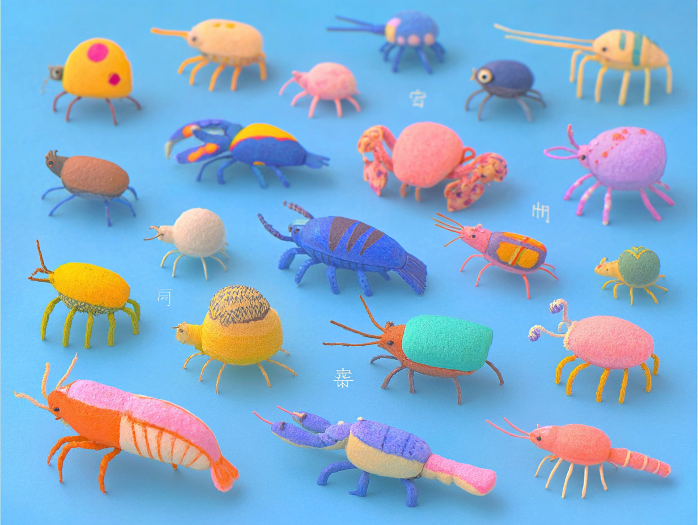

# Les keywords de Go



Dans le langage Go, il existe 25 mots clés :

`break`   `default`   `func`   `interface`   `select`
`case`   `defer`   `go`   `map`   `struct`
`chan`   `else`   `goto`   `package`   `switch`
`const`   `fallthrough`   `if`   `range`   `type`
`continue`   `for`   `import`   `return`   `var`

**Objectif :** utiliser des mots clés afin de commencer à découvrir la syntaxe.

1. Dans le fichier `main.go`, utiliser un maximum de mots clés.
2. Dans votre terminal, exécuter votre code :

```sh
go run .
```

Doc : [Keywords](https://go.dev/ref/spec#Keywords)
